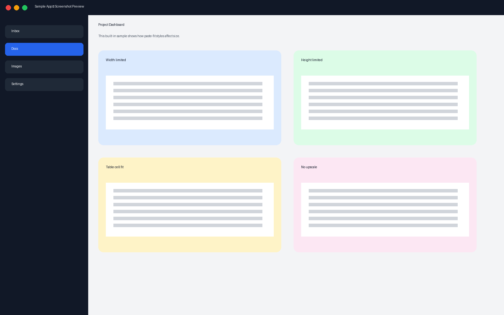

# Word Paste Image Fit

把截图粘进 Word，终于不用再一点点拖。

面向 **Windows 桌面版 Microsoft Word** 的开源小工具：粘贴图片时按你设好的样式自动缩放，并提供类似打印排版的**即时预览**——改参数，立刻看到下一张图会长什么样。

[English](./README.en.md) · [路线图](./docs/ROADMAP.md) · [表格单元格说明](./docs/TABLE_CELL.md)

---

## 它解决什么问题

截屏后直接 `Ctrl+V` 进 Word，图片经常按屏幕像素尺寸贴进来：比页面还宽、比单元格还大，只能反复拖拽。

Word 自带的「嵌入型」最多帮你缩到版心宽；如果你想：

- 宽高同时限制（长截图也不撑满整页）
- 固定成 14cm / 版心 90% 这类规则
- 贴进表格时按**单元格**而不是整页来缩
- 调参时先看到效果再粘贴

……就需要更明确的「粘贴样式」。本项目就是为此而做。



## 核心能力（当前 MVP）

| 能力 | 说明 |
|------|------|
| 即时排版预览 | 独立窗口，拖动参数立刻更新预览（类似打印预览的反馈感） |
| 内置示例图 | 调参不依赖剪贴板；没有图也能演示 |
| 宽 + 高双限制 | 避免「宽度合适了但高度炸页」 |
| 样式预设 | 笔记 / 论文 / 固定 14cm，可继续扩展 |
| 表格单元格自适应 | 光标在单元格内时，按格子可用宽高缩放 |
| 中英界面 | UI 可切换语言 |
| 智能粘贴 | 通过 Word COM 粘贴并套用当前样式 |
| 不捣乱 | 默认**不接管** `Ctrl+V`，普通粘贴不受影响 |

配置保存在：`%AppData%\word-paste-image-fit\settings.json`

## 一分钟上手

要求：Windows、已安装桌面版 Word、本机有 Python 3。

```powershell
cd word-paste-image-fit
powershell -ExecutionPolicy Bypass -File .\scripts\install.ps1
powershell -ExecutionPolicy Bypass -File .\scripts\run_preview.ps1
```

也可以从开始菜单打开 **Word Paste Image Fit**。

建议流程：

1. 拖「最大宽度 / 最大高度」滑块，看右侧预览变化
2. 需要时勾选「预览：模拟粘贴进表格」
3. 打开 Word，点 **智能粘贴到 Word**
   - 剪贴板有图 → 用你的截图
   - 没有图 → 用内置示例图演示
4. 可选热键助手：`$env:PYTHONPATH="src"; .\.venv\Scripts\python.exe -m wpif.hotkeys`（`Ctrl+Alt+V`）

## 「表格单元格内自适应」简述

光标在表格格子里粘贴时，按**单元格**缩放，而不是按整页版心。否则截图会按页面去算，轻易把表格撑爆。细节见 [docs/TABLE_CELL.md](./docs/TABLE_CELL.md)。

## 项目结构

```
src/wpif/     预览窗 + 缩放算法 + Word 粘贴
config/       默认样式预设
assets/       内置示例截图
vba/          后续 .dotm / 宏方案镜像
scripts/      安装与启动脚本
docs/         路线图与概念说明
tests/        几何/适配单元测试
```

## 现状与规划

- **现在（Phase A）**：Python 预览工作室 + COM 智能粘贴，够日常自用和开源冷启动
- **下一步（Phase B）**：更好的安装包、自动更新、`.dotm` 打包
- **再往后（Phase C）**：原生 COM/VSTO 加载项，体验更接近「Word 插件」

完整清单：[docs/ROADMAP.md](./docs/ROADMAP.md)

暂不承诺：macOS Word、Word 网页版、以 WPS 为第一目标平台。

## 参与贡献

欢迎 Issue / PR。优先欢迎这些方向：

- 预览窗交互与可读性
- 粘贴边界情况（浮动图、多栏、分节）
- 安装体验与文档
- 热键与「仅图片时接管 Ctrl+V」的稳妥实现

## 开源协议

[MIT](./LICENSE) — 宽松授权，方便个人使用、二次开发和集成。
